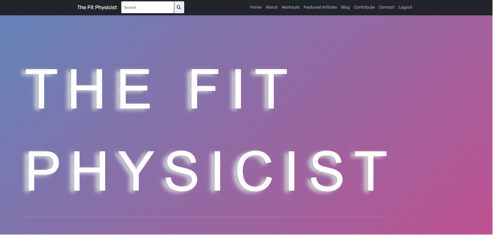

# TheFitPhysicist

**TheFitPhysicist** is a personal blog and portfolio-style web application built with Flask. It features dynamic routing, blog post creation via an admin panel, contact functionality, and sitemap support for SEO. The project is designed to showcase my work, thoughts, and updates through a sleek, easily maintainable platform.

---
<a href="https://github.com/c-lombardi23/thefitphysicist.onrender.com">
  
</a>

## Features

-  Blog post creation/editing through Flask-Admin
-  User authentication with Flask-Login
-  Contact form with email support (Flask-Mail)
-  Sitemap generation (Flask-Sitemap)
-  SEO-friendly routing
-  SQLite database (can be swapped for PostgreSQL)
-  Modular structure using Blueprints
-  Docker-ready (optional with Gunicorn)

---

###  Project Structure

The project is organized into a standard Flask application structure to ensure maintainability and separation of concerns.

```
new_fit_physicist/
│
├── app.py              # Main Flask application factory and entry point
├── admin.py            # Flask-Admin interface configuration
├── models_forms.py     # SQLAlchemy database models and WTForms definitions
│
├── routes/             # --- Flask Blueprints for modular routing ---
│   ├── __init__.py
│   └── (auth_routes.py, blog_routes.py, ...)
│
├── templates/          # --- Jinja2 HTML templates ---
│   ├── includes/         # Reusable template partials (navbar, footer)
│   └── (index.html, login.html, ...)
│
├── static/             # --- Static assets ---
│   ├── css/
│   ├── js/
│   └── images/
│
├── migrations/         # Database migration scripts (Alembic)
├── chris_blog.db       # SQLite database file for development
├── requirements.txt    # List of Python dependencies for pip
├── sitemap.xml         # Sitemap for search engine optimization (SEO)
├── google*.html        # Google site verification file
└── README.md           # Project documentation
```

## Tech Stack
- Backend: Flask, Flask-Login, Flask-Admin, Flask-WTF, SQLAlchemy
- Database: SQLite (default), PostgreSQL (optional)
- Frontend: HTML5, CSS3, Jinja2 templates
- Email: Flask-Mail
- Deployment: Gunicorn

